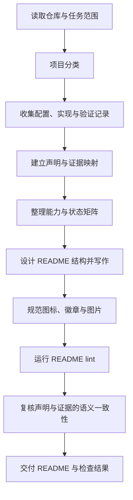

<p align="center">
  
</p>

<h1 align="center">READMEWriter</h1>

<p align="center"><strong>Evidence-aware documentation skill for Codex</strong></p>
<p align="center">从仓库证据出发，编写可追溯、可检查的 README。</p>

<p align="center">
  <a href="LICENSE"></a>
  <a href="SKILL.md"></a>
  <a href="#自动校验"></a>
</p>

<p align="center">
  <a href="#快速开始">快速开始</a> ·
  <a href="#工作流程">工作流程</a> ·
  <a href="#声明与证据">声明与证据</a> ·
  <a href="#自动校验">自动校验</a> ·
  <a href="#评估与验证">评估与验证</a> ·
  <a href="#许可与生成内容">许可与生成内容</a>
</p>

## 项目概览

READMEWriter 是一项面向 Codex 的文档技能，将项目分类、证据收集、README 编写、视觉规范和离线 lint 串成完整流程。它适用于新建 README、审阅现有文档和统一多项目的文档质量。

核心要求是让重要声明有依据：配置声明了什么、源码实现了什么、在哪些环境验证过、是否确有发行包，分别采用与证据匹配的措辞。图标、徽章和排版服务于这些信息的呈现。

| 组成 | 作用 |
| --- | --- |
| [技能入口](SKILL.md) | 指导 Agent 分类项目、收集证据、写作和复核 |
| [15 类项目规范](references/project-profiles.md) | 定义必须回答的信息、建议章节、不可默认推断的结论和验证目标 |
| [声明与证据规范](references/evidence-guide.md) | 将关键结论关联到配置、实现或验证记录 |
| [离线校验器](scripts/validate_readme.py) | 检查链接、图片、锚点、占位符、徽章身份和证据引用完整性 |
| [评估样例](evals/README.md) | 七类工程的输入、任务、参考结果及语义评审标准 |

写作指令无需编译。校验器需要 **Python 3.9+**，仅使用标准库；不依赖第三方 Python 包，不联网，也不执行 README 中的命令。

## 快速开始

### 1. 安装技能

下载或克隆本仓库，在包含 `SKILL.md` 的仓库根目录运行以下命令。命令适用于 macOS / Linux：

```sh
(
  set -eu
  test -f SKILL.md
  test -f LICENSE
  test -f OUTPUT-LICENSING.md
  test -f agents/openai.yaml
  test -f scripts/validate_readme.py
  test -d references

  README_WRITER_DEST="${CODEX_HOME:-$HOME/.codex}/skills/readme-writer"
  if [ -e "$README_WRITER_DEST" ] || [ -L "$README_WRITER_DEST" ]; then
    echo "目标已存在，请先备份并检查后再更新：$README_WRITER_DEST"
    exit 1
  fi

  mkdir -p "$(dirname "$README_WRITER_DEST")"
  mkdir "$README_WRITER_DEST"
  cp SKILL.md LICENSE OUTPUT-LICENSING.md "$README_WRITER_DEST/"
  cp -R agents references scripts "$README_WRITER_DEST/"
  echo "已安装到：$README_WRITER_DEST"
)
```

未设置 `CODEX_HOME` 时，默认位置为 `~/.codex/skills/readme-writer/`。也可手动复制上述文件和目录。已有同名技能时，先备份再更新；升级旧版本时需要补齐 `scripts/` 与新增参考文档。

`assets/` 用于仓库展示，`tests/` 与 `evals/` 用于维护者验证，均不参与日常写作。完整评估需在本仓库运行。

### 2. 在项目中调用

在 Codex 中打开目标项目，输入：

```text
使用 $readme-writer 优化当前项目 README。
先判断项目类型，将平台、功能和验证结论关联到仓库证据，
再整理结构、图标和徽章，运行 lint 并复核声明与证据是否一致。
```

完整重写或审计时，可进一步指定：

```text
同时将关键声明记录到 docs/readme-evidence.json。
对配置、模拟器与真机结果分别描述，不补造缺失的验证记录。
```

显示名称为 **READMEWriter**，调用名称为 **`$readme-writer`**。安装后在新任务中检查技能是否可用；若尚未显示，重新打开 Codex 后再检查。

## 工作流程



小范围编辑只处理受影响内容，无需为每句话生成记录。完整重写或证据审计需要追踪影响使用决策的关键声明。

分类覆盖 Mobile App、Desktop App、Browser Extension、CLI、Library / SDK、Embedded Firmware、Hardware Project、Hardware + Software System、AI Application、Model Benchmark、Dataset、Agent Skill、Web App、Static Web Project 和 Research Prototype。

每类规范提供 `required_sections`、`recommended_sections`、`forbidden_assumptions` 与 `verification_targets`。必需项表示文档应回答的信息，不强制固定标题；混合项目可以组合类别。详见 [分类说明](references/project-profiles.md) 与 [结构化数据](references/project-profiles.json)。

## 声明与证据

同一项能力，在不同证据条件下需要不同表述：

| 已有证据 | 合适的措辞 | 不应据此直接写成 |
| --- | --- | --- |
| 最低部署版本配置 | 项目最低部署目标配置为 iOS 26.0 | 已验证支持所有 iOS 26 设备 |
| 实现了某功能入口 | 源码包含相关实现，运行情况尚未验证 | 功能已经稳定可用 |
| 模拟器导航测试 | 在指定模拟器中完成导航检查 | 真机性能与稳定性验证通过 |
| 某设备的测试记录 | 在所列设备和条件下通过对应测试 | 全平台、全设备兼容 |
| 标签和版本文件 | 源码版本为某版本 | 已发布可下载安装包 |

证据 JSON 保存 README 原句、证据等级、来源路径、摘录和推理说明，并可附加 SHA256 检测来源变化。检查器会核对声明与摘录是否存在、文件是否可读及哈希是否一致。

**文件与摘录一致，不等于结论真实或完整。** Agent 或评审者仍需判断证据是否支持结论、环境是否匹配，以及是否遗漏了没有登记的强断言。格式与示例见 [Claim → Evidence](references/evidence-guide.md)。

## 自动校验

在 READMEWriter 仓库中检查当前 README：

```sh
python3 scripts/validate_readme.py README.md --root .
```

安装后，可从任意目标仓库运行：

```sh
python3 "${CODEX_HOME:-$HOME/.codex}/skills/readme-writer/scripts/validate_readme.py" README.md --root . --format json
```

已建立证据记录时，加上 `--evidence docs/readme-evidence.json`。如果没有可识别的 GitHub origin，可以用 `--repo owner/repo` 明确期望仓库；第三方徽章通过 `--allow-badge-repo owner/repo` 显式放行。

| 检查 | 覆盖范围 |
| --- | --- |
| 文件与图片 | 本地 Markdown / HTML 引用、路径大小写、越出仓库的链接 |
| 标题与导航 | 常见 GitHub 标题锚点、中文与重复标题、本地跨文件锚点、重复 H1 |
| 模板残留 | 常见占位符与待办标记，包含代码示例 |
| 本机路径 | 常见用户目录、临时目录、Windows 盘符/UNC 和 file URL |
| 仓库徽章 | GitHub Shields 徽章中的 owner/repo 与目标仓库是否匹配 |
| 证据完整性 | JSON 格式、README 原句、证据文件、摘录与可选哈希 |

默认有错误时返回 `1`；`--strict` 会将警告也视为失败，便于接入 CI。完整参数和诊断见 [校验说明](references/linting.md)。

校验器是面向常见 README 的轻量解析器，不是完整 GFM 引擎。它不验证远端链接可用性、徽章实时数值或自然语言事实，也不把目录树和所有反引号文本都当作文件引用。复杂 Markdown 与页面视觉仍需复核。

## 评估与验证

七类样例分别覆盖 iOS App、CLI、Python Library、Embedded Firmware、Model Benchmark、Browser Extension 与 Agent Skill，特别检查“配置与验证混淆”“文件大小与内存混淆”“编译与硬件成功混淆”等问题。

```sh
python3 -m unittest discover -s tests -v
python3 scripts/run_evals.py --output evals/results/reference-integrity.json
```

第一条运行校验器回归测试；第二条检查合成夹具的错误能被发现、参考 README 与证据记录能够通过完整性检查。

**参考结果由本次实现 Agent 编写，不是独立生成评估。** 运行器不会调用模型，报告标注 `model_invoked: false` 与 `semantic_review: not_run`。有意保留这一边界，避免把自动检查通过率宣传为跨项目写作成功率。

评估真实 Agent 输出时，将各 case 的结果保存到自己的候选目录，再运行 `run_evals.py --candidates`，并按各自 rubric 单独评审语义准确性。输入隔离、记录字段和操作步骤见 [评估说明](evals/README.md)。

## 写作与视觉规范

默认使用正式简体中文，尊重用户指定语言和项目已有约定。首屏提供定位与关键入口，正文用短段落、步骤和必要表格组织信息。图标优先复用项目素材，徽章统一样式，截图注明环境与来源。

具体规则见 [写作规范](references/writing-guide.md) 和 [视觉规范](references/visual-guide.md)。风格参考七个真实项目，但参考来源本身不作为技能有效性的证明；设计取舍见 [来源记录](references/style-origins.md)。

## 文件结构

```text
READMEWriter/
├── SKILL.md                    技能入口
├── LICENSE                     技能包 GPL 第 3 版许可证
├── OUTPUT-LICENSING.md          生成内容许可政策
├── agents/                     显示名称与默认提示词
├── references/                 写作、视觉、分类、证据与 lint 规范
├── scripts/
│   ├── validate_readme.py      离线 README 与证据完整性检查
│   └── run_evals.py            参考结果 / 候选结果检查
├── tests/                      校验器与评估运行器回归测试
├── evals/                      七类合成工程、任务、参考结果与 rubric
├── assets/                     仓库展示图标
└── README.md                   安装与使用说明
```

## 贡献

修改校验器时补充能够重现问题的最小文档及预期诊断；修改写作规则时提供项目事实、生成结果和证据评审。新增评估需同时覆盖合理结论与容易出现的过度承诺，不以固定措辞或标题数量代替事实判断。

提交前运行回归测试、参考评估和当前 README lint。不要提交私人日志、用户凭据或未脱敏路径；本地评估输出默认放在已忽略的 `evals/results/`。

## 许可与生成内容

技能指令、规范、脚本与评估文件采用 [GPL-3.0-only](LICENSE)。Copyright © 2026 Roylyl。第三方内容保留原有权利与许可。

**我们不要求用户仅因使用本技能，就将其项目或生成、改写的 README 改为 GPL。** 输出依据其实际内容和用户项目的授权安排处理；若实质复制技能包或第三方受保护内容，仍需遵循相应许可。详见 [Output licensing policy](OUTPUT-LICENSING.md)。
